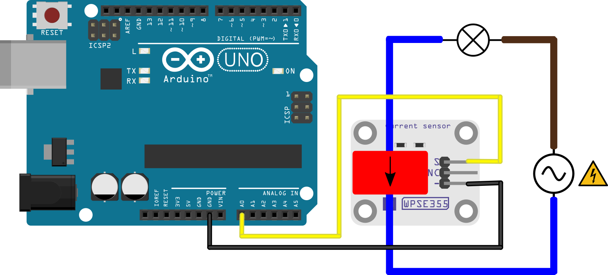

# Current sensor module
This example shows how to measure the output of the current sensor and calculate the corresponding AC current with an Arduino® compatible board.

The example program reads the analog signal output from the ```S``` pin on the module, calculates the corresponding current, and prints the result in the serial monitor.

## Library dependencies
* None

## Wiring diagram


## Additional information
  For more information about the Whadda WPSE352 photosensitive sensor module, check the manual available at [whadda.com](https://whadda.com/product/WPSE355).
